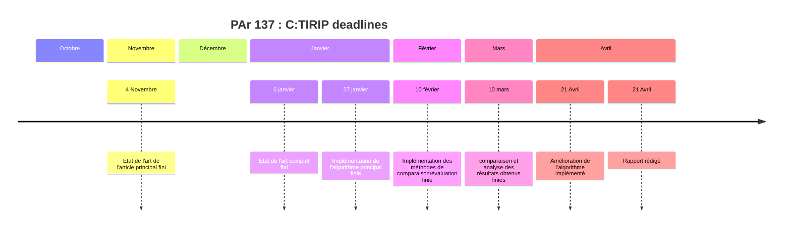
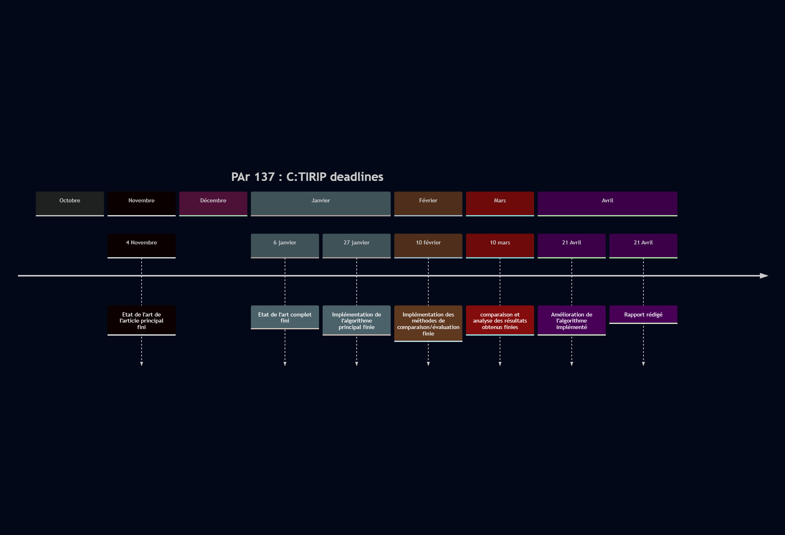

# PAr-C-TIRIP
Ce git est destiné aux péripéties du Projet Ar de nous deux (lui et moi), qui vont surement péripéter

# A faire

## Implémenter l'algorithme présenté

* Choix du langage utilisé, et des librairies préexistantes
* Détection de saillances
* Insertion du Watermark
* Extraction du Watermark
* Algos de test

## Faire un Etat de l'art

* Approfondissement article principal
* Décider des autres algos existantsà étudier
* Se pencher sur les algos choisis
* Etudier les méthodes de comparaison de performance

## Comparer les résulats obtenus à ceux documentés

* Implémentation des méthodes de comparaison
* Comparaison aux résultats donnés
* Analyse

## S'il reste du temps:

### Rapport final scientifique
En LaTeX 

### Améliorer la méthode proposée

* Watermark en texte plutot qu'en image ? 
* Redondance ? 
* Voir la section drawbacks du doc 

# Deadlines

* Etat de l'art de l'article principal d'ici mi novembre

* Algorithme principal implémenté d'ici fin décembre

